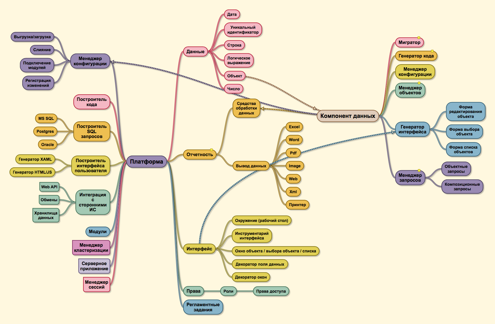

# Содержание

# Вступление

В современном мире очень важно время и минимизация издержек на разрабтку. Существует достаточно много различных технологий, благодаря которым строятся современные высокопроизводительные системы. 

Я два года посвятил себя разработке на 1С и глубокому изучению этой платформы. Я был удивлён, насколько просто и быстро можно накидать примитивный прототип. При этом я не концентрировался на вещах, типа: "А как же мне передать данные клиенту", или: "Нужно забиндить объект на форму". Большинство таких вещей делается автоматически. Эту идею я и выделил для себя: инструмен для разработки должен быть с максимально низким порогом вхождения. Не нужно понимать какие-то низкоуровневые вещи, нужно лишь разбираться в бизнесе и уметь перенести реальный процесс в предприятии на бумагу. Это и стало основным критерием для платформы: инструмент должен быть лёгкий и в тоже время не ограничивать потенциал опытных разработчиков.

По мере того, как я разбирался в платформе 1С я выделил для себя несколько вещей, которые на мой взгляд достаточно критичны:

1. Отсутствие наследования. Согласитесь, если вы можете разделить документы на два типа: приходные и расходные, которые в принципе, делают одинаковые операции по отпределённым регистрам и у всех есть какой-то одинаковый набор свойств. И завтра вместо того чтобы идти по всем, допустим, приходным документам и добавлять новую логику, достаточно добавить её в родителе.

2. Скудный набор инструментов для выборки данных из базы данных. В 1С нельзя пользоваться всей мощью языка SQL. Например оконными функциями с предложением OVER(), что добавляет трудности и уменьшает производительность, когда нужно сделать сложную локигу с выборкой. Здесь есть справедливое допущение - не все RDBMS(Relation Database Management System) поддерживают одинаковое подмножество языка SQL. В виду этого можно ввести уровни совместимости, почему этого не сделано в 1С непонятно.

3. Медленная работа встроенного интерпретатора. Реально, ужасная работа. Вы только попробуйте написать какой-нибудь алгоритм на 1С, работающий с массивами данных и на C#.

4. Закрытость платформы. Платформа закрыта, и бог знает что там у неё под капотом. Завтра начнут собирать телеметрию, а вы и знать не будите.

5. Отстутствиие расширяемости. Вы не можете ничего дописать, даже с боку подписать, ибо лицензионное соглащение. В структуры не лезьте.

Проведя в размышлениях примерно полтора года, за это время я несколько раз возвращался к теме создания собственной открытой платформы для быстрого создания бизнес-приложений. После того, как у меня в голове построился определённый план, и я понял, что все куски разработки закрыть реально, и приступил к проектированию архитектуры.

Первое правило которое было взято за основу: "Программа должна быть разделена на две части: конфигурация и платформа". Только с помощью этого можно обеспечить простоту. 

Так как я программировал на C# ранее я захотел запустить данную экосистему именно на нём. Для начала, я не хотел закладывать потенциал, хуже, чем в 1С. Разработка не должна испытывать дефицит каких-либо инструментов. В первую очередь я посмотрел в сторону кросплатформенности. Выбор стал очевиден - ```NET Core```.

После этого остро встал вопрос о том, что же использовать для отображения данных пользователю. Это также должен быть кросплатформенный UI. Для этого прекрасно подходит фрейморк для кросплатформенной разработки интерфейсов Avalonia. Мало того что это проект со свободной лицензией, так ещё построен на принципах ```WPF``` (также используется язык разметки ```XAML```). 

Как клиентское приложение будет жить в вебе - пока не ясно. Думаю, что будет компонент для генерации веб-интерфейса для пользователя. Т.е. вместо того, чтобы генерировать XAML + C#, будет генерироваться HTML + JS, пока что вижу это как-то так.

Вопросы кластеризации и коммутации разных компонентов приложения между собой я сильно не продумывал, хотелось бы сделать всё через сообщения, понятно дело, что чем больше компонентов в системе, тем она сложней, но с помощью механики сообщений мне кажется можно лекго распределять нагрузку, коммутировать их

Общая карта проекта:



# Конфигурация 

## Структура

Конфигурация состоит из следующих разделов:

1. **Данные** (Data system). Подсистема для работы с данными. А именно выполнение CRUD(CREATE\READ\UPDATE\DELETE) операций над ними.
2. **Доступ к данным** (Role system). Подсистема для разграничения доступ к данным
3. **Отображение** (Interface system). Подсистема обеспечивающая доступ к данным определённого типа через какой-либо интерфейс (web\desktop client)
4. **Отчетность** (Report system). Подсистема обеспечивающая вывод какого-либа набора данных в определённом формате с возможностью сохранить\распечатать эти данные
5. **Произвольная логика** (Modules system). Произвольная логика, может быть независима от данных.
6. **Регламентные задания** (Schedule system). Переодические задания
7. **Локализация** (Language system). Доступные языковые пакеты системы
8. **Интеграция данных** (Integration system). Подсистема интеграции с другим ИС.
## Данные 

### (Root -> Data -> Components -> Component)

В данных описываются все компоненты, которые подключены к конфигурации. 

Пример:
```xml
<Component>
    <File Path="./Components/DocumentComponent.dll"/>
</Component>
```

При загрузке конфигурации dll по этому пути будет загружена с помощью метода ```Assembly.LoadFromFile(string)```
Если вы хотите подробней узнать о механизме загрузки конфигурации в платформу перейдите в этот раздел (TODO: добавить ссылку на раздел)

### (Root -> Data -> IncludedFiles -> File)

Также в данных опысываются файлы, так называемые исполняемые модули для платформы. Они подключаются следующим образом:

```xml
<IncludedFiles>
            <!--  Файл проекта, где ComponentId - это уникальный идентификатор компонента, с помощью
                  него будет осуществляться загрузка данного файла, если по какой-то из причин компонент не был найден,
                  то бует выдано исключение InvalidPlatformComponent -->
            <File Path="./Data/Documents/ВыдачаКниги.xml" ComponentId="230c6759-ae4e-408f-94b9-798749333f07"/>
</IncludedFiles>
```

В каждом файле описан объект согласно специфике компонента, к которому он привязан. Этот файл будет загружаться непосредственно компонентом и регистрироваться в общем списке доступных типов данных в платформе.

## Пример

Пример конфигурации в xml виде вы можете найти здесь (TODO: Добавить ссылку на пример конфигурации)

# Платформа

## Архитектура
Платформа состоит из следующих частей:

1. Компонент построителя запросов (QueryBuilder): Предоставляет удобный интерфейс для построения запросов из C#

2. Загрузчик конфигурации (Configuration): Набор логики для первоначальной загрузки конфигурации, проверки её на целостность и обеспечение интерфейсов для реализации их в компонентах

3. Компонент данных (DataComponent): Абстракция. Обеспечивает примитивную логико по работе компонента с данными.

4. Компонент генерации интерфейса (XamlBuilder): Представляет собой удобный интерфейс для построения XAML из C#

5. Серверное приложение : отвечает за обработку серверной логики, и полное обслуживание запросов клиентской части

6. Клиентское приложение : отчает за отображение данных клиенту при режиме работы клиента, как ThinClient

7. Сервер соединений : отвечает за подключение пользователей к серверу. Является промежуточным слоем, обеспечивает бесшовное обновление конфигурации. Клиент подключён к серверу, но ждёт, пока ему разрешат работать с данным объектом, если он затронут.

8. Менеджер кластера : отвечает за распределение нагрузки между серверами (wide scale)

9. Сервер обновлений : отвечает за предоставление обновлений для клиента

## Компонент данных


# IDE 

Платформа предназначена для быстрой разработки бизнес приложений с аналитикой для десктоп систем. 
Компоненты системы:
1) Компилятор запросов: обеспечивает транлитерацию встроенных команд в язык T-SQL.
3) Язык описания конфигурации
2) Менеджер объектов
3) Менеджер сессий
4) Подсистема репликации
5) Подсистема взаимодействия участников обмена