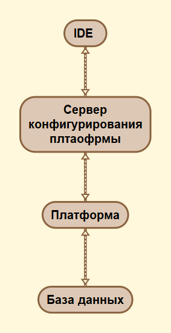

# Содержание

# Вступление

# <center><span style="align:center; color:red">Внимание! Обращу внимание на то, что это лишь сыроватая версия без вычитки </span></center>

В современном мире очень важно время и минимизация издержек на разрабтку. Существует достаточно много различных технологий, благодаря которым строятся современные высокопроизводительные системы. 

Я два года посвятил себя разработке на 1С и глубокому изучению этой платформы. Я был удивлён, насколько просто и быстро можно накидать примитивный прототип. При этом я не концентрировался на вещах, типа: "А как же мне передать данные клиенту", или: "Нужно забиндить объект на форму". Большинство таких вещей делается автоматически. Эту идею я и выделил для себя: инструмен для разработки должен быть с максимально низким порогом вхождения. Не нужно понимать какие-то низкоуровневые вещи, нужно лишь разбираться в бизнесе и уметь перенести реальный процесс в предприятии на бумагу. Это и стало основным критерием для платформы: инструмент должен быть лёгкий и в тоже время не ограничивать потенциал опытных разработчиков.

По мере того, как я разбирался в платформе 1С я выделил для себя несколько вещей, которые на мой взгляд достаточно критичны:

1. Отсутствие наследования. Согласитесь, если вы можете разделить документы на два типа: приходные и расходные, которые в принципе, делают одинаковые операции по отпределённым регистрам и у всех есть какой-то одинаковый набор свойств. И завтра вместо того, чтобы идти по всем, допустим, приходным документам и добавлять новую логику, достаточно добавить её в родителе.

2. Скудный набор инструментов для выборки данных из базы данных. В 1С нельзя пользоваться всей мощью языка SQL. Например оконными функциями с предложением OVER(), что добавляет трудности и уменьшает производительность, когда нужно сделать сложную локигу с выборкой. Здесь есть справедливое допущение - не все RDBMS(Relation Database Management System) поддерживают одинаковое подмножество языка SQL. В виду этого можно ввести уровни совместимости, почему этого не сделано в 1С непонятно.

3. Медленная работа встроенного интерпретатора. Реально, ужасная работа. Вы только попробуйте написать какой-нибудь алгоритм на 1С, работающий с массивами данных и на C#.

4. Закрытость платформы. Платформа закрыта, и бог знает что там у неё под капотом. Завтра начнут собирать телеметрию, а вы и знать не будите, если уже не собирают.

5. Отстутствиие расширяемости. Вы не можете ничего дописать, даже с боку подписать, ибо лицензионное соглащение обязывает вас не лезти в структуры данных 1С.

Проведя в размышлениях примерно полтора года, за это время я несколько раз возвращался к теме создания собственной открытой платформы для быстрого создания бизнес-приложений. После того, как у меня в голове построился определённый план, и я понял, что все куски разработки закрыть реально, и приступил к проектированию архитектуры.

Первое правило которое было взято за основу: "Программа должна быть разделена на две части: конфигурация и платформа". Только с помощью этого можно обеспечить простоту. 

Так как я программировал на C# ранее я захотел запустить данную экосистему именно на нём. Для начала, я не хотел закладывать потенциал, хуже, чем в 1С. Разработка не должна испытывать дефицит каких-либо инструментов. В первую очередь я посмотрел в сторону кросплатформенности. Выбор стал очевиден - ```NET Core```.

После этого остро встал вопрос о том, что же использовать для отображения данных пользователю. Это также должен быть кросплатформенный UI. Для этого прекрасно подходит фрейморк для кросплатформенной разработки интерфейсов Avalonia. Мало того что это проект со свободной лицензией, так ещё построен на принципах ```WPF``` (также используется язык разметки ```XAML```). 

Как клиентское приложение будет жить в вебе - пока не ясно. Думаю, что будет компонент для генерации веб-интерфейса для пользователя. Т.е. вместо того, чтобы генерировать XAML + C#, будет генерироваться HTML + JS, пока что вижу это как-то так. Сейчас есть подаёт признаки жизни проект на mono, для компиляции C# -> wasm. Это может сыграть на руку.

Вопросы кластеризации и коммутации разных компонентов приложения между собой я сильно не продумывал, хотелось бы сделать всё через сообщения, понятно дело, что чем больше компонентов в системе, тем она сложней, но с помощью механики сообщений мне кажется можно лекго распределять нагрузку, коммутировать их

Общая карта проекта:


# Структура проектов

Стуруктура каталогов проекта:

    + Avalonia - Здесь располагаются исходные коды проектов относящихся непосредственно к Avalonia
    + CLI - Здесь располагаются все проекты, которые связаны с консольным тулингом (Command Line Interface)
        + ZenPlatform.Cli - Консольная утилита для работы с платформой
    + Components - Компоненты платформы, такие как документы
        + ZenPlatform.DataComponent - Базовый компонент данных
        + ZenPlatform.EntityComponent - Имплементация компонента данных. Простая сущность.
    + Examples - Примеры конфигурации
        + ZenPlatform.ConfigurationExample
    + IDE - Все компоненты которые как-либо связанны с IDE
    + Tests - Юнит тесты
    + UI - Все проекты связанные с пользовательским интерфейсом
        + ZenPlatform.Controls.Avalonia - Контролы для платформы, с использованием Avalonia
        + ZenPlatform.Controls.Wpf - Контролы для платформы с использованием WPF
        + ZenPlatform.Interface - ???
        + ZenPlatform.Pidl - Проект, по работе с языком PIDL. Позволяет легко описывать графический интерфейс платформы
        + ZenPlatform.QueryUIBuilder - UI тулинг для построителя запросов
        + ZenPlatform.ThinClient - Тонкий клиент
        + ZenPlatform.UIBuilder - API для генерации декларирования интерфейса
    + ZenPlatform.Configuration - Конфигурация платформы и её инфраструктура
    + ZenPlatform.ConnectionServer - Сервер соединеинй, нужен для приёма соединения от клиента и передачи управления на конкретный экземпляр рабочего процесса.
    + ZenPlatform.Core - связующее звено. Здесь находится логика которая связывает все компоненты вместе (Конфигурация, База данных, Процессы)
    + ZenPlatform.Data - Работа с данными: Подулючения, Контексты, Менеджеры
    + ZenPlatform.Initializer - Начальная инициализация платформы в новой среде. Обслуживает базу данных.
    + ZenPlatform.Migration - Миграция проекта (Deprecated)
    + ZenPlatform.PlatformCodeGenerator (Deprecated)
    + ZenPlatform.QueryBuilder - Построитель запросов. Предоставляет удобное API для генерации текста запроса для разных СУБД
    + ZenPlatform.Settings - параметры 
    + ZenPlatform.Shared - Общий проект
    + ZenPlatform.System - ???
    + ZenPlatform.WorkProcess - Обеспечивает связь между сервером и соответственно функциями платформы.
    


# Конфигурация 

## Структура

Конфигурация состоит из следующих разделов:

1. **Данные** (Data system). Подсистема для работы с данными. А именно выполнение CRUD(CREATE\READ\UPDATE\DELETE) операций над ними.
2. **Доступ к данным** (Role system). Подсистема для разграничения доступ к данным
3. **Отображение** (Interface system). Подсистема обеспечивающая доступ к данным определённого типа через какой-либо интерфейс (web\desktop client)
4. **Отчетность** (Report system). Подсистема обеспечивающая вывод какого-либа набора данных в определённом формате с возможностью сохранить\распечатать эти данные
5. **Произвольная логика** (Modules system). Произвольная логика, может быть независима от данных.
6. **Регламентные задания** (Schedule system). Переодические задания
7. **Локализация** (Language system). Доступные языковые пакеты системы
8. **Интеграция данных** (Integration system). Подсистема интеграции с другим ИС.
## Данные 

### (Root -> Data -> Components -> Component)

В данных описываются все компоненты, которые подключены к конфигурации. 

Пример:
```xml
<Component>
    <File Path="./Components/DocumentComponent.dll"/>
</Component>
```

При загрузке конфигурации dll по этому пути будет загружена с помощью метода ```Assembly.LoadFromFile(string)```
Если вы хотите подробней узнать о механизме загрузки конфигурации в платформу перейдите в этот раздел (TODO: добавить ссылку на раздел)

### (Root -> Data -> IncludedFiles -> File)

Также в данных опысываются файлы, так называемые исполняемые модули для платформы. Они подключаются следующим образом:

```xml
<IncludedFiles>
            <!--  Файл проекта, где ComponentId - это уникальный идентификатор компонента, с помощью
                  него будет осуществляться загрузка данного файла, если по какой-то из причин компонент не был найден,
                  то бует выдано исключение InvalidPlatformComponent -->
            <File Path="./Data/Documents/ВыдачаКниги.xml" ComponentId="230c6759-ae4e-408f-94b9-798749333f07"/>
</IncludedFiles>
```

В каждом файле описан объект согласно специфике компонента, к которому он привязан. Этот файл будет загружаться непосредственно компонентом и регистрироваться в общем списке доступных типов данных в платформе.

## Пример

Пример конфигурации в xml виде вы можете найти здесь (TODO: Добавить ссылку на пример конфигурации)

# Платформа

## Архитектура
Платформа состоит из следующих частей:

1. Компонент построителя запросов (QueryBuilder): Предоставляет удобный интерфейс для построения запросов из C#

2. Загрузчик конфигурации (Configuration): Набор логики для первоначальной загрузки конфигурации, проверки её на целостность и обеспечение интерфейсов для реализации их в компонентах

3. Компонент данных (DataComponent): Абстракция. Обеспечивает примитивную логико по работе компонента с данными.

4. Компонент генерации интерфейса (XamlBuilder): Представляет собой удобный интерфейс для построения XAML из C#

5. Серверное приложение : отвечает за обработку серверной логики, и полное обслуживание запросов клиентской части

6. Клиентское приложение : отчает за отображение данных клиенту при режиме работы клиента, как ThinClient

7. Сервер соединений : отвечает за подключение пользователей к серверу. Является промежуточным слоем, обеспечивает бесшовное обновление конфигурации. Клиент подключён к серверу, но ждёт, пока ему разрешат работать с данным объектом, если он затронут.

8. Менеджер кластера : отвечает за распределение нагрузки между серверами (wide scale)

9. Сервер обновлений : отвечает за предоставление обновлений для клиента

## **Компонент построителя запросов**

### Вступление

Компонент, работающий с данными обязан предоставлять к ним какой-то удобный интерфейс, но в свою очередь платформа позволяет работать с различными СУБД. Для того, чтобы не переписывать запросы под каждую СУБД был разработан компонент генерации запросов. Он имеет унифицированное API, позволяющее собирать запросы. Имеются некоторые ограничения по его использованию. Например, не для всех СУБД есть возможность использовать те или иные инструкции. В случае, если вы воспользовались инструкцией, не поддерживаемой в провайдере СУБД, будет выдана ошибка: ```NotImplementedException```

## Описание и примеры
На начальной стадии есть следующая поддержка: (MSSQL, PostgreSQL(не полная поддержка)) 


Пример генерации запроса на языке ```C#```:

SELECT : 
```csharp
var q = new SelectQueryNode()
                .WithTop(10)
                .From("Table1", (t) => t.As("t1"))
                .Join(JoinType.Inner, "test", t => t.As("t2"),
                    o => o.On("t1", "FiledT1", "=", "t2", "FieldT2"))
                .Join(JoinType.Full,
                    (nastedQuery) =>
                    {
                        nastedQuery.Select("SomeField").From("TableNasted", t => t.As("tn"))
                            .Join(JoinType.Left, "NastedJoinTable", t => { t.As("njt"); },
                                j => j.On("tn", "fn", "<=", "njt", "fn"))
                            .Where(f => f.Field("f1"), "=", f => f.Parameter("Param"));
                    },
                    (n) => { n.As("Nasted"); }, (o) => o.On("t1", "FieldT1", "<>", "Nasted", "NastedField"))
                .Select(tableName: "someTable", fieldName: "field1", alias: "HeyYouAreNewField")
                .SelectRaw("CASE WHEN 1 = 1 THEN '1' ELSE '2' END")
                .Where((f) => f.Field("field1"), "=", (f) => f.Field("field2"));
```

Результат :

```sql 
SELECT TOP 10 [someTable].[field1] AS [HeyYouAreNewField], CASE WHEN 1 = 1 THEN '1' ELSE '2' END
FROM 
    [Table1] AS [t1]
    INNER JOIN [test] AS [t2] ON [t1].[FiledT1]=[t2].[FieldT2]
    FULL JOIN (SELECT [SomeField]
FROM 
    [TableNasted] AS [tn]
    LEFT JOIN [NastedJoinTable] AS [njt] ON [tn].[fn]<=[njt].[fn]
WHERE 
    [f1]=@Param) AS [Nasted]
WHERE 
    [field1]=[field2]

```

UPDATE : 
```csharp
 var u = new UpdateQueryNode()
        .Update("t")
        .Set(f => f.Field("t", "Field1"), v => v.Parameter("p0"))
        .From("TestTable", "t")
        .WhereLike(f => f.Field("t", "Field1"), "a%");
```

Результат :

```sql 
UPDATE
    [t]
SET
    [t].[Field1]=@p0
FROM 
    [TestTable] AS [t]
WHERE 
    [t].[Field1] LIKE 'a%'
```

DELETE : 
```csharp
var d = new DeleteQueryNode()
        .Delete("t")
        .From("TestTable", t => t.As("t").WithSchema("dbo"))
        .WhereLike(f => f.Field("t", "Field1"), "a%");
```

Результат :

```sql 
DELETE
    [t]
FROM 
    [dbo].[TestTable] AS [t]
WHERE 
    [t].[Field1] LIKE 'a%'
```

INSERT : 
```csharp
var i = new InsertQueryNode()
        .InsertInto("dbo", "Test")
        .WithFieldAndValue(x => x.Field("One"), v => v.Parameter("p0"))
        .WithFieldAndValue(x => x.Field("Two"), f => f.Parameter("p1"));
```

Результат :

```sql 
INSERT INTO [dbo].[Test]([One], [Two]) VALUES(@p0, @p1)
```

CREATE TABLE : 
```csharp
var cr = new CreateTableQueryNode("dbo", "someAlterTable")
        .WithColumn("Id", f => f.Int())
        .WithColumn("Name", f => f.Varchar(30).NotNull());
```

Результат :

```sql 
CREATE TABLE [dbo].[someAlterTable]([Id] [int],[Name] [varchar](30) NOT NULL)
```

ALTER TABLE : 

```csharp
var a = new AlterTableQueryNode("someAlterTable", t => t.WithSchema("dbo"));
        a.AddColumn("SomeField", f => f.Guid().NotNull());
```

Результат :

```sql 
ALTER TABLE [dbo].[someAlterTable] ADD [SomeField] [uniqueidentifier] NOT NULL
```
<br>
<br>

# **Компонент генерации интерфейса**

### Вступление

Для унификации вида интерфейса платформы и, конечно же, её упрощения, был введён дополнительный слой абстракции. Генератор интерфейса представляет лёгковесное API для создания компонентов интерфейса. Работает  всё это по следующему принципу:


Клиент взаимодействует с компонентом отображения через конекретное API, которое позволяет унифицировать отображение: т.е. в любом случае, если у нас есть кнопка она будет отображена в одном и том же месте. В качестве компонента отображения в платформе выбран развивающийся проект [Avalonia](https://github.com/AvaloniaUI/Avalonia/issues).

Для компонентов, которые поддерживают визуализацию данных это должно быть прозрачно. Т.е. если выаш компонент хочет визуализировать данные посредством платформы - пожалуйста, если нет, то прийдётся использовать свой собственный инструмент для этого (но не нужно забывать, что в основе всего этого лежит XAML, поэтому не нужно будет переизобретать велосипед, достаточно будет описать свой компилятор)

## Описание формы.

Для того, чтобы дать возможность описывать пользовательский интерфейс объекта компонента данных необходимо прийти к какому-то формату данных. Предлагается сделать это всё в виде XML. 

Основные элементы формы:

* Фрагмент - Кусок описания интерфейса для повторного использования
* Группа - объединяет в контейнер элементы интерфейса
* Поле - Представление данных (Таблица \ Поле выбора объекта \ Текстовое поле \ Флажок \ Выбор
даты или времени \ Кнопка \ Картинка )
* Ссылка на фрагмент

Для этого необходимо описать структуру и возможности. 

Platform Interface Definition Language (PIDL) 
PIDL - это подмножество языка XAML. и обрабатывается он точно также

Пример описания формы одного объекта:

```xml
<!-- Поле "ТипДанных"(data_type) Представлены тут схематично. Это, конечно же, будет перечисление -->
<Form>
    
    <!-- Для фрагмента важно указать тип -->
    <Fragment Id="AB1A3649-53A6-4259-B746-6E7CEB79E7A3" DataType="AB1A3649-53A6-4259-B746-6E7CEB79E7A3">
        Здесь описание компонента
    </Fragment>

    <!-- Помимо локальных фрагментов есть ещё глобальные фрагменты -->

    <Group>
        <!--Где Height - это количество строк, которые умещаются в поле в высоту Width - количество символов-->
        <field Source="Комментарий" Height="1" Width="200" />

        <!--
        Если установлен флаг AddvancedMode, в таком случае: Height - высота в пикселях,  Width - ширина в пикселях
        
        Также доступны отступы - Margins
        
        Какие ещё функции должны быть доступны в advanced mode и может быть он должен быть сразу выставлен на форму
        -->
        <field Source="Текст1" AdvancedMode="true" Height="25" Width="200" Margin="0,10,23,10"
            Padding="10,10,10,10" />

        <!--Автоматически будет сгенерирована таблица -->
        <field Source="Товары">
            <!-- Расширение свойства. Для каждого типа есть Своё расширение отображения. Например можно устанавливать видимые столбцы -->
            <table:extension>
                <columns>
                    <column Source="Колонка1" />
                    <column Source="Колонка2" />
                    <column Source="Колонка3" />
                </columns>
            </table:extension>
        </field>

        <!--Автоматически будет сгенерировано поле даты и времени -->
        <field Source="ДатаДокумента" Enable="true" />
    </Group>

    <fragment_ref Id="AB1A3649-53A6-4259-B746-6E7CEB79E7A3" /> <!-- А вот тут мы подключаем компоненет-->

    <fragment_ref Id="AB1A3649-53A6-4259-B746-6E7CEB79E7A3" /> <!-- Мы можем ссылаться на 1 и тот же фрагмент сколько угодно раз-->
</form>
```

Заострю своё внимание на том, как именно должны работать расширения свойства рассмотрим детальнее на основе примера, который изображён выше.

```xml

    <field Source="Товары">
            <!-- Расширение свойства. Для каждого типа есть Своё расширение отображения. Например можно устанавливать видимые столбцы -->
            <table:extension>
                <columns>
                    <column Source="Колонка1" />
                    <column Source="Колонка2" />
                    <column Source="Колонка3" />
                </columns>
            </table:extension>
        </field>

```

Как это обрабатывается. Рассказываю: у каждого компонента, есть несколько общих для платформы классов, которые собственно и обслуживают инородные вставки.
```table:extension``` как раз такие такой класс. Расширение для своёства может быть только одно. Каждый компонент, который реализует взаимодействие данных с интерфейсом, обязан
имплементировать класс расширения свойств. 

Этот класс должен регистрироваться в общем пуле

# **Серверное приложение**

### Вступление 

Серверное приложение, как и говорилось ранее, отвечает за обработку запросов клиента. Помимо этого серверное приложение обеспечивает ещё один целостный уровень изоляции данных. Здесь можно блокировать данные, также серверная часть полностью обеспечивает RLS(Row-Level Security).

Серверная часть имеет внутри себя несколько компонентов. 

1) Сервер системных процессов
2) Сервер рабочих процессов

Сервер системных процессов обеспечивает обновление различных компонентов системы, в то время как рабочий процесс обеспечивает работу с данными. Основная особенность этого механизма - __***полное динамическое обновление системы***__ в режиме реального времени. Это достигается за счет блокировки только обнолвяемых объектов в рабочем процессе, после обновления, блокировка отпускается и все существующие соединения начинают работась совым рабочим процессом, а старый рабочий процесс убивается. Более подробный механизм обновления конфигурации описан в разделе ([TODO: написать раздел обновления конфигурации]())  

Основное отличие рабочего процесса от системного - невозможность рабочего процесс менять структуру данных.


# Клиентское приложеине

### Вступление

Клиентское приложеине - неотьемлемая часть программы учавствующая в жизненном цикле данных. Комплекс явлется непосредственным источником и манипулятором данных. Клиенское приложение выполняет роль тонкого клиента. Т.е. вся логика по обработке данных находится на сервере. На клиенте есть лишь минимальный набор функций, связанных с трансформацией данных представления, подсчёт итогов и т.д.


# Миграция данных

Пока что я просто оставлю это здесь

 Ниже представлен алгоритм, как будет колонка разворачиваться в базу данных:

Допустим, компонент добавляет префикс к полю Fld. Номер поля берётся таблицы объектов.

Итого получаем следующий расклад
DatabaseColumnName = Fld_035|Fld_035_TypeId|Fld_035_TypeRef|Fld_035_Binary|Fld_035_Guid|Fld_035_Int|Fld_035_DateTime|Fld_035_String

 Когда Types.Count() == 1 и Types[0] is XCPrimitiveType
 В таком случае выделяется единственная колонка колонка для хранения
      Guid || binary || bool || int || datetime
 Когда Types.Count() == 1 и Types[0] is XCObjectType и Type.IsAabstract в таком случае выделяются две колонки
      IntTypeId, GuidRef
 Когда Types.Count() == 1 и Types[0] is XCObjectType и !Type.IsAabstract в таком случае выделяется две или одна колонка.
 Примечание. Всё зависит от того, есть ли унаследованные объекты от текущего объекта
      GuidRef \ IntTypeId, GuidRef
 Когда Types.Count() > 1 и все Types is XCPrimitiveType
      В таком случае на каждый тип отводится своя колонка. Биндинг должен осуществляться таким
      не хитрым мапированием: Свойство, Тип -> Колонка


# IDE 

Самый, пожалуй большой раздел. Здесь должно описываться полное взаимодействие с разработчиком.

## Сервер конфигурации
Сервер конфигурации это промежуточный слой абстракции для работы с конфигурацией.
Этот промежуточный слой содержит модель, которая передаётся в ПО, для отображения.

Эта прослойка работает как почтовое отделение. 

Например: к нам приходит сообщение, о том, что необходимо распахнуть ветку дерева конфигурации.
У нас, в сервере конфигурации есть модель текущего сеанса. Мы распахиваем ветку. и возвращаем
модель-разницу обратно, и благополучно применяем её на клиенте.

Более близко к теме

Допустим, у нас сейчас такое состояние:

    - Корень
        - Данные
            + Документы
            + Справоники
            + Регистры
        + Отчеты
        + Интерфейс
        + API
        + Модули

Мы распахиваем пункт "Документы". На сервер конфигурации летит 
сообщение: "РаспахнутьЭлемент(ИдЭлемента, ИдСессии)". После этого, на сервере происходит разворот
этого элемента в результате чего мы имеем следующую модель:

    - Корень
        - Данные
            - Документы
                + ПриходнаяНакладная
                + РасходнаяНакладная
                + Перемещение
                + Списание
            + Справоники
            + Регистры
        + Отчеты
        + Интерфейс
        + API
        + Модули

В клиентскую сторону передаётся лишь следующая информация:
    
    + ПриходнаяНакладная
    + РасходнаяНакладная
    + Перемещение
    + Списание

## Плюсы и минусы

    + Имплементация на 1 раз. Вся работа с моделью осуществляется через специальную модель команд. Т.е. нет никакого недопонимания в имплементации через разные платформы (VS, AvalonStudio, VS Code... и так далее )
    - Сложность реализации. Необходимо продумыввать и контролировать ещё один слой абстракции для работы с конфигурацией, хотя... Это всё такие, сомнительные трудности
    + Лёгкая интеграция куда угодно. Необходимо только лишь имплементировать команды
    + Расширяемость. На разных платформах (предположим) могут быть доступны разные функции.
    + 



### Поддерживаемые команды:
 
 * Редактировать настройки конфигурации

 * Добавить компонент
 * Удалить компонент
 * Редактировать настройки компонента
 
 * Добавить объект компонента
 * Редактировать объект компонента
 * Удалить объект компонента
 
 * Редактировать интерфейс объекта компонента
 
 * Получить дерево объектов конфигурации
 * Распахнуть ветку дерева объектов конфигурации
 * Свернуть ветку дерева конфигурации
 * Добавить пользователя
 * Редактировать пользователя
 * Удалить пользователя
 * Просмотреть журнал событий
 * Добавить роль
 * Редактировать роль
 * Удалить роль
 * ?

<span style="color:red; font-weight: bold;">Внимание! До меня неожиданно дошло что сервер управления конфигурацией необходим, можно сказать, 
спонтанно, и это решение либо чертовски офигенное, либо чертовски бредовое. Я считаю, что это необходимо реализовать для 
прототипа.</span>